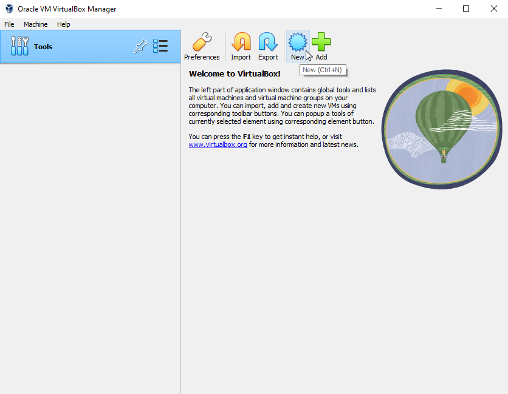
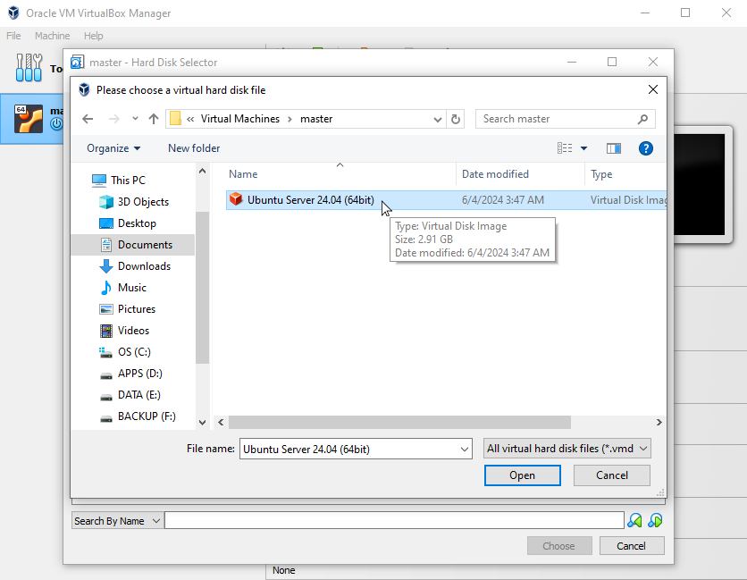
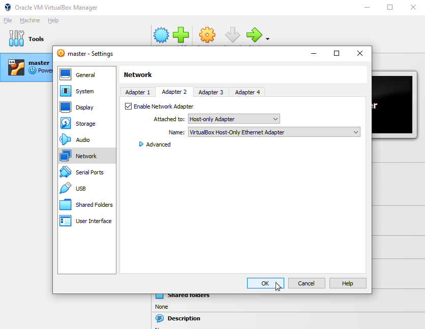

# Hadoop Multi Node Cluster Setup

### This is what you need:

1. Oracle VirtualBox
2. Ubuntu Server _vdi_ file
3. Apache Hadoop
4. Apache Hadoop config files
5. This README file :)

---

### Let's go:

#### 1. Install VirtualBox on your system.

#### 2. Download Ubuntu Server VDI Image from [OsBoxes](https://www.osboxes.org) and extract it in a folder.

#### 3. In VirtualBox create new VM and set it's name to **master** and hoose system requirements like below.

- Number of processors: 1
- RAM: 2048 GB
- Network: NAT
- Do not add a virtual hard disk

##### You can see these steps in images below.




---

#### 4. Create a directory in your _Virtual Machines_ folder and copy the downloaded _vdi_ file there. Then attach the _vdi_ to your virtual machine as _SATA_ controller.

##### You can see these steps in images below.





---

#### 5. Login to your virtual system with credentials below.

> Username: osboxes  
> Password: osboxes.org

---

#### 6. Create new admin user _"hduser"_. We use this account to install and configure Hadoop. Then logout from current user (default user).

```bash
terminal> sudo adduser hduser
terminal> sudo usermod -aG sudo hduser
terminal> exit
```

---

#### 7. After you login to _"hduser"_ account, edit your _DNS_ config file to increase software update speed.

1.  Execute command below.

```bash
terminal> sudo nano /etc/resolv.conf
```

2.  Remove everything and add these configs to your file, then press **ctrl + x** and then press **y** to save it.

```txt
nameserver 8.8.8.8
nameserver 8.8.4.4
```

##### **If there is no text editor app like _nano_ in your _Ubuntu Server_, you can execute command below to do it by built-in _Bash_ commands**

```bash
terminal> sudo su
root@terminal> printf "nameserver 8.8.8.8\nnameserver 8.8.4.4\n" > /etc/resolv.conf
root@terminal> exit
```

---

#### 8. Now you can download & install necessary softwares.

```bash
terminal> sudo apt clean && sudo apt autoclean && sudo apt update && sudo apt upgrade && sudo apt dist-upgrade
terminal> sudo apt install nano vim ssh net-tools openjdk-8-jdk git
```

##### **If you don't want to use _Java_ for _MapReduce_ programming, you should install desired programming language compiler too. For example if you want to use _Python_, you should execute commands below too.**

```bash
terminal> sudo apt install python3 python-is-python3
```

#### Now shutdown your machine using command below

```bash
terminal> init 0
```

---

#### 9. In VirtualBox, create a new Host-only network adapter

> File -> Host Network Manager -> Create

- vboxnet0 -> Adapter -> IPv4 Address: 192.168.56.1
- vboxnet0 -> Adapter -> IPv4 Network Mask: 255.255.255.0
- vboxnet0 -> DHCP Server -> Enable DHCP server
- vboxnet0 -> DHCP Server -> Server Address: 192.168.56.2
- vboxnet0 -> DHCP Server -> Server Mask: 255.255.255.0
- vboxnet0 -> DHCP Server -> Lower Address Bound: 192.168.56.101
- vboxnet0 -> DHCP Server -> Upper Address Bound: 192.168.56.254

##### You can see these steps in images below.


---

#### 10. Setup VM Network

> VM -> Settings -> Network Settings

Enable another adapter (Adapter2) as below

> "Host-only Adapter" -> vboxnet0 -> OK

##### You can see these steps in images below.




---

#### 11. Login into VM with _"hduser"_ and define our static ip address.

1.  Execute command below.

```bash
terminal> sudo ip a
terminal> sudo nano /etc/netplan/01-netcfg.yaml
```

2. Add these configs to your file, then press **ctrl + x** and then press **y** to save it.

```yaml
network:
  version: 2
  renderer: networkd
  ethernets:
    enp0s3:
      dhcp4: true
    enp0s8:
      addresses: [192.168.56.50/24]
      dhcp4: false
```

3. Apply this config to your machine and check your new adapter ip.

```bash
terminal> sudo netplan apply
terminal> sudo ip a
```

4. Execute these command to edit your hosts file.

```bash
terminal> sudo nano /etc/hosts
```

5. Add these hosts to your file, then press **ctrl + x** and then press **y** to save it.

```txt
192.168.56.50 master
192.168.56.51 worker1
192.168.56.52 worker2
192.168.56.53 worker3
```

6. Execute these command to change your host name permanently.

```bash
terminal> sudo hostnamectl set-hostname master
```

#### 12. Copy the _hadoop-3.3.6.tar.gz_ file from **host** to **master** using ssh.

1. Execute command below to copy _hadoop_ file from **host** to **master**.

```console
cmd> scp hadoop-3.3.6.tar.gz hduser@192.168.56.50:/home/hduser
```

##### Your hadoop version may be different than v3.3.6. So take care about it when you are executing related commands.

---

#### 13. Configure Hadoop.

1. Execute command below on **master** to extract _hadoop_ archive.

```bash
master-terminal> tar xvf hadoop-3.3.6.tar.gz
```

2. Execute command below on **master** to edit _.bashrc_ file.

```bash
master-terminal> cd ~
master-terminal> nano ~/.bashrc
```

3. Add this variables to _.bashrc_ file.

```bash
export JAVA_HOME=/usr/lib/jvm/java-8-openjdk-amd64
export HADOOP_HOME=$HOME/hadoop-3.3.6
export PATH=$HADOOP_HOME/sbin:$HADOOP_HOME/bin:$PATH
```

4. Apply changes to **bash**.

```bash
master-terminal> source ~/.bashrc
```

#### 14. clone the [_hadoop-cluster-install_](https://github.com/AlirezaSheikhiy/hadoop_cluster_install.git) repos file from github. Then copy **master** configs to this location.

```bash
master-terminal> git clone https://github.com/AlirezaSheikhiy/hadoop_cluster_install.git
master-terminal> cp hadoop-cluster-install/configs/master/* $HADOOP_HOME/etc/hadoop/
```

---

#### 15. Examine the **master** configration and shutdown your virtual machine.

```bash
master-terminal> cd $HADOOP_HOME/etc/hadoop/
master-terminal> cat core-site.xml
master-terminal> cat hadoop-env.sh
master-terminal> cat hdfs-site.xml
master-terminal> cat mapred-site.xml
master-terminal> cat yarn-site.xml
master-terminal> cat workers
master-terminal> init 0
```

---

#### 16. Create Linked Clone of this VM as _"worker1"_ and select option below.

> MAC Address Policy: Generate new MAC Addresses for all network adapters

---

#### 17. Login into new VM with _"hduser"_ and configure network and hadoop.

1.  Execute command below.

```bash
worker1-terminal> sudo ip a
worker1-terminal> sudo nano /etc/netplan/01-netcfg.yaml
```

2. Add these configs to your file, then press **ctrl + x** and then press **y** to save it.

```yaml
network:
  version: 2
  renderer: networkd
  ethernets:
    enp0s3:
      dhcp4: true
    enp0s8:
      addresses: [192.168.56.51/24]
      dhcp4: false
```

3. Apply this config to your machine and check your new adapter ip.

```bash
worker1-terminal> sudo netplan apply
worker1-terminal> sudo ip a
```

4. Execute these command to change your hostname permanently.

```bash
worker1-terminal> sudo hostnamectl set-hostname worker1
```

5. Copy **worker** configs.

```bash
worker1-terminal> cd ~
worker1-terminal> cp hadoop-cluster-install/configs/worker/* $HADOOP_HOME/etc/hadoop/
```

---

#### 18. Examine the worker configration and turn off your virtual machine.

```bash
worker1-terminal> cd $HADOOP_HOME/etc/hadoop/
worker1-terminal> cat core-site.xml
worker1-terminal> cat hadoop-env.sh
worker1-terminal> cat hdfs-site.xml
worker1-terminal> cat mapred-site.xml
worker1-terminal> cat yarn-site.xml
worker1-terminal> init 0
```

---

#### 19. Create Linked Clone of master VM as _"worker2"_ and select option below.

> MAC Address Policy: Generate new MAC Addresses for all network adapters

---

#### 20. Login into new VM with hduser and configure network and hadoop.

1.  Execute command below.

```bash
worker2-terminal> sudo ip a
worker2-terminal> sudo nano /etc/netplan/01-netcfg.yaml
```

2. Add these configs to your file, then press **ctrl + x** and then press **y** to save it.

```yaml
network:
  version: 2
  renderer: networkd
  ethernets:
    enp0s3:
      dhcp4: true
    enp0s8:
      addresses: [192.168.56.52/24]
      dhcp4: false
```

3. Apply this config to your machine and check your new adapter ip.

```bash
worker2-terminal> sudo netplan apply
worker2-terminal> sudo ip a
```

4. Execute these command to change your hostname permanently.

```bash
worker2-terminal> sudo hostnamectl set-hostname worker2
```

5. Copy **worker** configs.

```bash
worker2-terminal> cd ~
worker2-terminal> cp hadoop-cluster-install/configs/worker/* $HADOOP_HOME/etc/hadoop/
```

6. Turn off **worker2** machine.

```bash
worker2-terminal> init 0
```

---

#### 21. Create Linked Clone of this VM as _"worker3"_ and select option below.

> MAC Address Policy: Generate new MAC Addresses for all network adapters

---

#### 22. Login into new VM with hduser and configure network and hadoop.

1.  Execute command below.

```bash
worker3-terminal> sudo ip a
worker3-terminal> sudo nano /etc/netplan/01-netcfg.yaml
```

2. Add these configs to your file, then press **ctrl + x** and then press **y** to save it.

```yaml
network:
  version: 2
  renderer: networkd
  ethernets:
    enp0s3:
      dhcp4: true
    enp0s8:
      addresses: [192.168.56.53/24]
      dhcp4: false
```

3. Apply this config to your machine and check your new adapter ip.

```bash
worker3-terminal> sudo netplan apply
worker3-terminal> sudo ip a
```

4. Execute these command to change your hostname permanently.

```bash
worker3-terminal> sudo hostnamectl set-hostname worker3
```

5. Copy **worker** configs.

```bash
worker3-terminal> cd ~
worker3-terminal> cp hadoop-cluster-install/configs/worker/* $HADOOP_HOME/etc/hadoop/
```

6. Turn off **worker3** machine.

```bash
worker3-terminal> init 0
```

---

#### 23. Start all VMs. Copy **master** ssh id on all workers. Ensure that master is able to login to itself and all workers without password over ssh.

```console
cmd-1 > ssh hduser@192.168.56.50
cmd-2 > ssh hduser@192.168.56.51
cmd-3 > ssh hduser@192.168.56.52
cmd-4 > ssh hduser@192.168.56.53

cmd-1 | master-terminal> ssh-keygen -t rsa -P ""

cmd-1 | master-terminal> ssh-copy-id hduser@master
cmd-1 | master-terminal> ssh-copy-id hduser@worker1
cmd-1 | master-terminal> ssh-copy-id hduser@worker2
cmd-1 | master-terminal> ssh-copy-id hduser@worker3
```

---

#### 24. Start Hadoop and verify.

```console
cmd-1 | master-terminal> hdfs namenode -format

cmd-1 | master-terminal> start-all.sh

cmd-1 | master-terminal> jps
cmd-2 | worker1-terminal> jps
cmd-3 | worker2-terminal> jps
cmd-4 | worker3-terminal> jps
```

---

#### 25. Upload a file on HDFS to verify if cluster and replication is working properly.

```bash
master-terminal> echo "Welcome to Hadoop cluster" > hello.txt
master-terminal> hadoop fs -put hello.txt /
master-terminal> hadoop fs -ls /
master-terminal> hadoop fs -cat /hello.txt
```

---

#### 26. Now you can access these web interfaces from the host machine and even check hdfs file manager. Here are the default URLs for accessing the web interfaces.

##### HDFS Web Interface (NameNode UI)

- **URL**: `http://192.168.56.50:9870`
- **Purpose**: Provides information about the HDFS filesystem, including health, data nodes, file system usage, etc.

##### YARN ResourceManager Web Interface

- **URL**: `http://192.168.56.50:8088`
- **Purpose**: Shows the status of YARN applications, resource usage, and node managers.

##### Hadoop JobHistory Server (if using MapReduce)

- **URL**: `http://192.168.56.50:19888`
- **Purpose**: Displays information about completed MapReduce jobs.

---

#### 27. Stop the Hadoop and verify.

```bash
master-terminal> stop-all.sh
```

---

#### 28. Shutdown all VMs.

---

#### **Now Hadoop is ready on your virtual network and clusters for MapReduce programming.**
